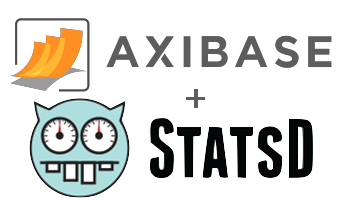

# ATSD Backend for StatsD



## Table of Contents

* [Overview](#overview)
* [Configuration](#configuration)
  * [Supported Variables](#supported-variables)
* [Patterns](#patterns)

## Overview

The **ATSD Backend** for [StatsD](https://github.com/etsy/statsd) forwards metrics collected by the StatsD daemon into [Axibase Time-Series Database](https://axibase.com/docs/atsd/) for retention, analytics, visualization, and alerting.

Install the ATSD Backend with `npm`.

```sh
sudo npm install atsd-statsd-backend
```

## Configuration

Example configuration file:

```sh
{
    atsd : {
        host: "atsd_server",
        port: 8081,
        protocol: "tcp",
        patterns: [
            {
                pattern: /^([^.]+\.){2}com\..+/,
                atsd_pattern: "<entity>.<>.<>.<metrics>"
            },
            {
                pattern: /.*/,
                atsd_pattern: "<entity>.<metrics>"
            }
        ]
    },
    port: 8125,
    backends: [ "./node_modules/atsd-statsd-backend/lib/atsd" ],
    debug: true
}
```

### Supported Variables

 Variable| Description| Default Value
:--|:--|:--
 `debug`       | Enable debug logging.<br>Possible values: `true`, `false`.| `false`
 `keyNameSanitize`       | Sanitize metric names by removing forbidden characters.<br>Possible values: `true`, `false`.| `true`
 `flush_counts` | Process flush counts.<br>Possible values: `true`, `false`. | `true`
 `atsd`         | Container for all Backend-specific options.  | `-`
 `atsd.host`    | ATSD hostname.   | `-`
 `atsd.port`    | ATSD port.       | `8081`
 `atsd.user`    | Username.        | `""`
 `atsd.password`         | Password for ATSD login.| `""`
 `atsd.protocol`         | Protocol.<br>Possible values: `"tcp"`, `"udp"`.       | `"tcp"`
 `atsd.entity`  | Default entity.  | Local hostname.
 `atsd.prefix`  | Global prefix for each metric.      | `""`
 `atsd.prefixCounter`    | Prefix for counter metrics         | `"counters"`
 `atsd.prefixTimer`      | Prefix for timer metrics. | `"timers"`
 `atsd.prefixGauge`      | Prefix for gauge metrics. | `"gauges"`
 `atsd.prefixSet`        | Prefix for set metrics.   | `"sets"`
 `atsd.patterns`         | Patterns to parse statsd metric names.       | `-`
 `atsd.commandsPerBatch` | Maximum number of series commands to be sent per batch.      | `100`

> Specify other [StatsD variables](https://github.com/etsy/statsd/blob/master/exampleConfig.js) as well.

## Patterns

Patterns convert of native StatsD metric names into the ATSD [schema](https://axibase.com/docs/atsd/#schema).

If a metric name matches regexp `pattern`, it will be parsed according to `atsd_pattern`.

If a metric name has more tokens than `atsd_pattern`, extra tokens are cropped.

`alfa.bravo.charlie.delta` is used as an example metric and the default example entity is `zulu`.

 Token   | Description      | `atsd-pattern`         | Result
:--|:--|:--|:--|
 `<metric>`       | Metric token.<br> Multiple occurrences are combined.        | `<metric>.<metric>.<metric>`   | `series e:zulu m:alfa.bravo.charlie ...`
 `<entity>`       | Entity token to replace default entity.<br> Multiple occurrences are combined.      | `<entity>.<metric>.<entity>.<metric>`   | `series e:alfa.charlie m:bravo.delta ...`
 `<tag:tag_name>` | Token for the tag `tag_name`.  | `<entity>.<tag:test>.<metric>.<metric>` | `series e:alfa m:charlie.delta t:test=bravo ...`
 `<>`    | Excluded token.     | `<entity>.<tag:test>.<>.<metric>`       | `series e:alfa m:delta t:test=bravo ...`
 `<metrics>`      | Metric tokens.<br>Use once per pattern.<br>Omission is permissible: `<entity>..<tag:url>` | `<entity>.<tag:test>.<metrics>`         | `series e:alfa m:charlie.delta t:test=bravo ...`
